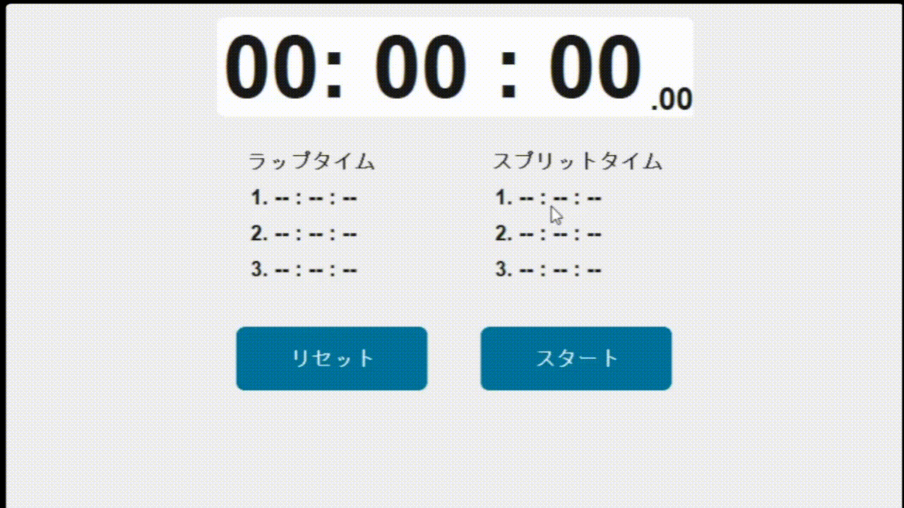

# ストップウォッチ (Python)

## 概要
このプロジェクトは、Pythonで作成されたシンプルなストップウォッチアプリケーションです。ラップタイムとスプリットタイムを計測する機能を持っています。

## 特徴
- スタート、ストップ、一時停止、リセット機能
- ラップタイムとスプリットタイムの表示
- カスタムTkinterを使ったGUIベースのインターフェース

## 環境設定
このプロジェクトを実行するために、以下のPythonライブラリが必要です。

## 必須ライブラリ
- Python 3.x
- CustomTkinter

## ディレクトリ構成
stopwatch_PJ/  
├── app/  
│   ├── __init__.py  # モジュール初期化用  
│   ├── stopwatch.py  # ストップウォッチのロジック  
│   └── stopwatchactivityhandler.py  # UIとロジックをつなぐクラス  
├── main.py  # GUIの設定とアプリケーションのエントリーポイント  
├── README.md  # プロジェクトの概要と説明  

## 使い方

